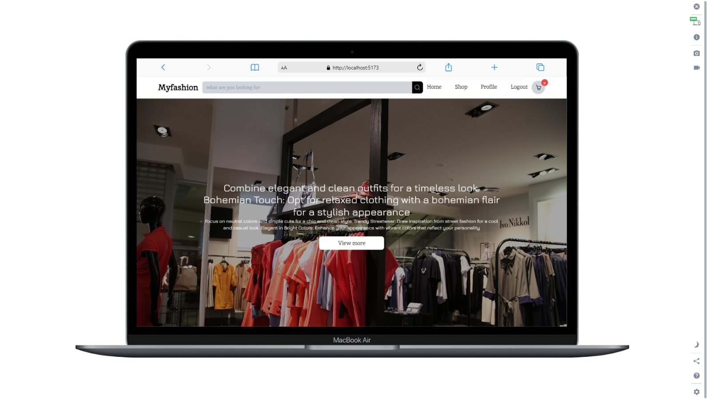

# React + Vite

- [@vitejs/plugin-react](https://github.com/vitejs/vite-plugin-react/blob/main/packages/plugin-react/README.md) uses [Babel](https://babeljs.io/) for Fast Refresh
- [@vitejs/plugin-react-swc](https://github.com/vitejs/vite-plugin-react-swc) uses [SWC](https://swc.rs/) for Fast Refresh

# MyFashion Frontend

- [Backend Link](https://github.com/Juaini742/market-place-be)

## Overview

Welcome to the MyFashion Frontend repository! This frontend application complements the MyFashion backend, providing users with an intuitive interface to explore fashion content, discover trends, and engage with their favorite brands.

## Table of Contents

1. [Introduction](#introduction)
2. [Features](#features)
3. [Getting Started](#getting-started)
4. [Folder Structure](#folder-structure)
5. [Dependencies](#dependencies)
6. [Setup](#setup)
7. [Usage](#usage)
8. [Components](#components)
9. [Styling](#styling)
10. [API Integration](#api-integration)
11. [Contributing](#contributing)
12. [License](#license)

## Introduction

The MyFashion Frontend is built with user experience in mind, providing a visually appealing and responsive design to enhance user engagement. It leverages the backend API to fetch and display fashion-related content seamlessly.

## Features

- **User Authentication:** Secure user authentication to enable personalized experiences and interactions.
- **Explore Trends:** Engaging UI to explore the latest fashion trends and discover new styles.
- **Brand Connection:** Connect with favorite brands, view their collections, and receive updates.
- **Intuitive Search:** User-friendly search functionality to find specific fashion items quickly.
- **Shopping Cart:** Convenient shopping cart for users to add and manage their selected items.

## Getting Started

To start using the MyFashion Frontend, follow these steps:

1. Clone the repository: `git clone https://github.com/Juaini742/market-place-fe`
2. Install dependencies: `npm install`
3. Configure environment variables (see [Setup](#setup) section).
4. Run the application: `npm run dev`

## Folder Structure

- `src/component/atoms`: Reusable React components.
- `src/component/pages`: Page Component File.
- `src/component/molecules`: Small Component of pages.
- `src/component/templates`: Template Component (navbar and footer).
- `src/contants`: Public Const Variable from .env.
- `src/hooks`: Custom hooks of redux.
- `src/router`: Router file.
- `src/store/actions`: Action File For Redux Using.
- `src/store/reducers`: Reducers File For Redux Using.
- `src/store/store.js`: Main Store File.

## Dependencies

- @reduxjs/toolkit
- antd
- axios
- buffer
- jsonwebtoken
- jwt-decode
- midtrans-client
- react-dom
- react-icon
- react-icons
- react-quill
- react-redux
- react-router-dom
- redux-thunk

## Setup

Before running the application, make sure to set up the following environment variables:

- `VITE_APP_PUBLIC_CLIENT`: Midtrans Public Key.
- `VITE_APP_API_URL`: Backend API URL.

## Usage

Once the frontend is up and running, users can interact with the application to explore fashion trends, connect with brands, and enjoy a personalized experience.

## Components

The components in the `src/components` folder are designed to be reusable and modular. Explore each component to understand its functionality and usage.

## Styling

The application utilizes Styled-components for styling, ensuring a consistent and visually appealing design. Check the `src/index.css` folder for styling files.

## API Integration

The frontend interacts with the MyFashion Backend API. Ensure that the backend is running and configured properly.

## Contributing

We welcome contributions! Feel free to submit pull requests or open issues for any enhancements or bug fixes.

## License

This project is licensed under the [MIT License](LICENSE). Feel free to use, modify, and distribute the code as per the terms of the license.
